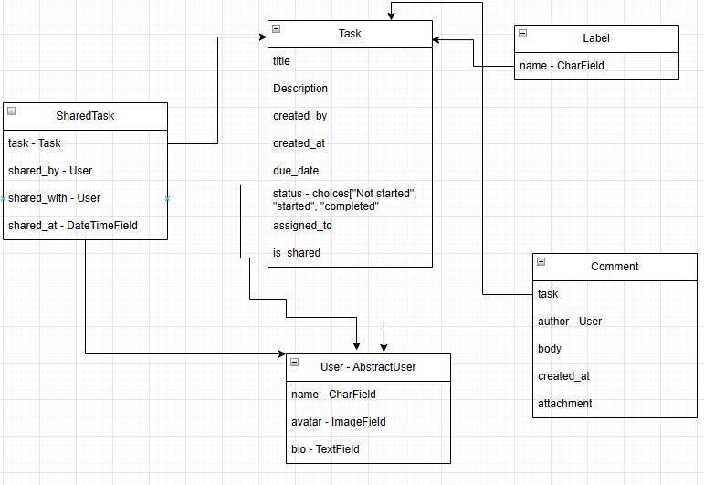

# DjangoTaskManagement
Create a Jira like task management system with django

# Starting point
- Clone the repository locally to your system: `git clone https://github.com/ChristosHadjigeorghiou1996/DjangoTaskManagement.git`.
- Create virtual environment: `python -m venv VENV_NAME`
- Activate it with `.\VENV_NAME\Script\activate` or `source VENV_NAME/bin/activate` depending on OS
- Install requirements.txt `pip install -r requirements.txt`
- Navigate to app folder and run `python manage.py test` to assert the correct installation of project.
- Create project by typing: `django-admin startproject PROJECT_NAME`
- Start project by going to the project via `cd PROJECT_NAME` and `python manage.py runserver`
- Run `python manage.py makemigrations` and `python manage.py migrate` to populate local db.

# Considerations
The fundamental principle is to store as minimal information as possible - cannot leak the data that is not there.

Enable users to create tasks and export / import them without having to register in.

# Initial Database schema
Initial idea is to have user be able to create tasks, share them with colleagues and label tasks as not_started, started or finished.

# Final notes
This project is just a simple task management to get accustomed with django.

It is not created with the aim to duplicate / replace any existing software.
